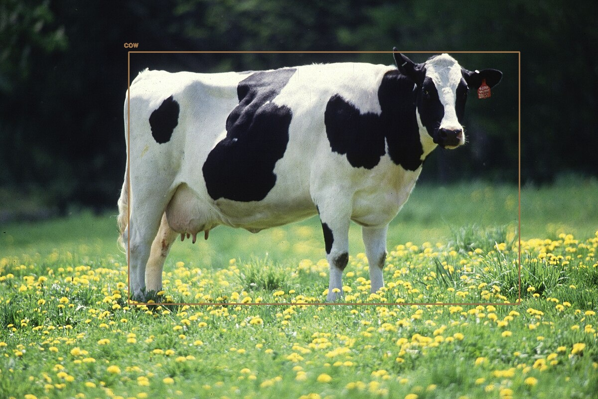

# Object detection using deep learning with OpenCV and Python 

OpenCV `dnn` module supports running inference on pre-trained deep learning models from popular frameworks like Caffe, Torch and TensorFlow. 

When it comes to object detection, popular detection frameworks are
 * YOLO (You Only Look Once)
 * SSD
 * Faster R-CNN
 
 Support for running YOLO/DarkNet has been added to OpenCV dnn module recently. 
 
 ## Dependencies
  * opencv
  * numpy
  
`pip install numpy opencv-python`

 ### sample output :
 

